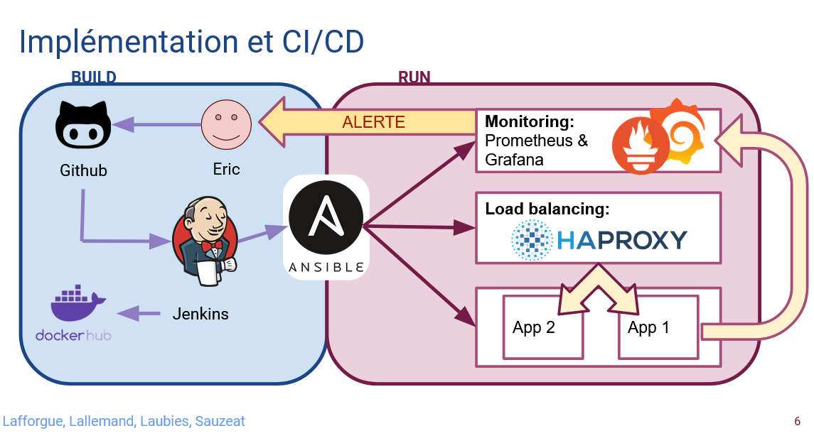

# Projet AJC L
This project is a CI/CD project using Jenkins, Ansible and Docker Container.

This projct simulate the client's need to have his flask application to be depolyed and maintained.

We do that by using Docker Containers with the client's app inside. We use Docker container to host our LoadBalancer and the alert system. We are using Ansible to deploy our architecture.

## Client's Application: Flask Pytest routing and requests example
Simple sample application demonstrating how to use Pytest with Flask for testing routing and requests.
The example includes a basic "hello world" route to demonstrate a GET request. The second example is 
a route that expects a POST request.

This need to be embeded inside a docker container.

## The LoadBalancer: HAProxy

Inside a Docker container, HAProxy configuration can be updated to match the need of the architeture, such as a new application or if the trafic demands the creation of mirroirs.

## Monitoring: Prometheus Container

Prometheus is our stats collector and alert laucher. Prometheus is inside a Docker container

When trouble appears on one of the docker container, Prometheus send a email and a cron task checks this email (#TODO) and launch a Jenkins pipeline to restart the container down.

## Infrastructure 

